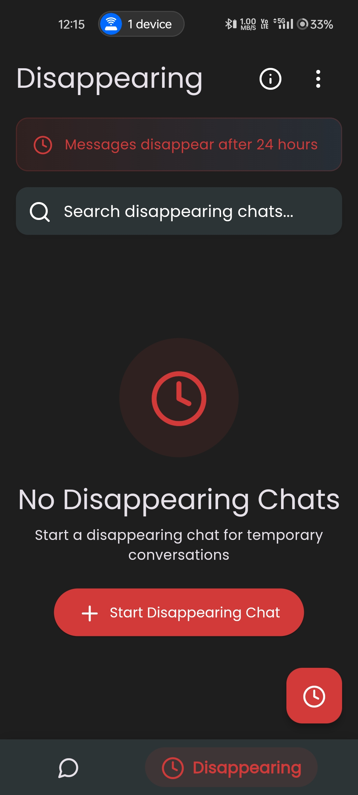
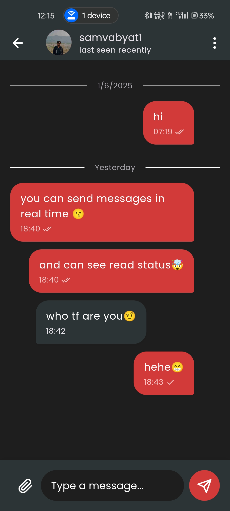

    
    <h1>rechat</h1>
    
Real time chat app in Flutter + Supabase

---

  
  
 
  
  

## Features
- Real time chat
- Disappearing messages
- Profile
- Search
- Dark Mode

## Installation

## Tech Stack

**Client:** Flutter, Android, Web, Ios

**Backend:**  Supabase (Postgresql, Storage, Auth)
